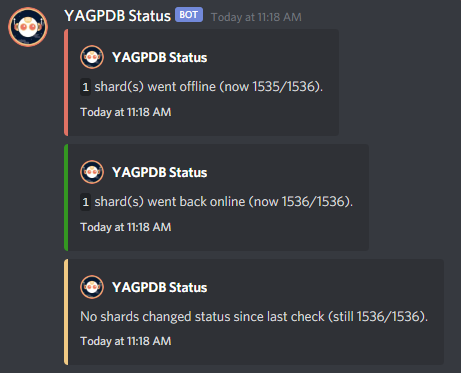

# `yag-status`

A set of Go scripts to monitor YAGPDB status by making `GET` requests to the YAGPDB status endpoint.

## What's included

-   Script to find how many shards are down
    -   Not super useful, but perhaps it's a slight improvement over spam refreshing the status page.
-   Script to find the status of YAGPDB on a guild
    -   You should probably use `cshard`.
-   Monitor YAGPDB status by posting to a Discord webhook periodically
    -   Keeps track of how many shards have gone up/down since the last check
    -   Probably the only actual useful one to be honest

## Usage

We include binaries with all our releases, so if you trust them, feel free to just download & run them. 
Note that if you are running the `monitor` script you will need a `config.json` filled out with the appropriate values in your working directory. 
An example of a valid `config.json` is [included in this repository](./monitor/config.example.json).

Otherwise, check out the [installation from source](#installation-from-source) section to build the binaries yourself.

## Installation from source

_Prerequisites:_ 

-   Go 1.16
-   Git

_Installation:_ 

1. `git clone https://github.com/jo3-l/yag-status`
2. `cd` into the directory of the script you want to use.
    - e.g. `cd downshards`
3. (Only if using `monitor`) Copy `monitor/config.example.json` to `monitor/config.json` and fill it out.
4. Run `go run .`

## Screenshots

## License

[MIT](./LICENSE.md)
